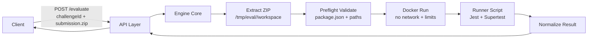
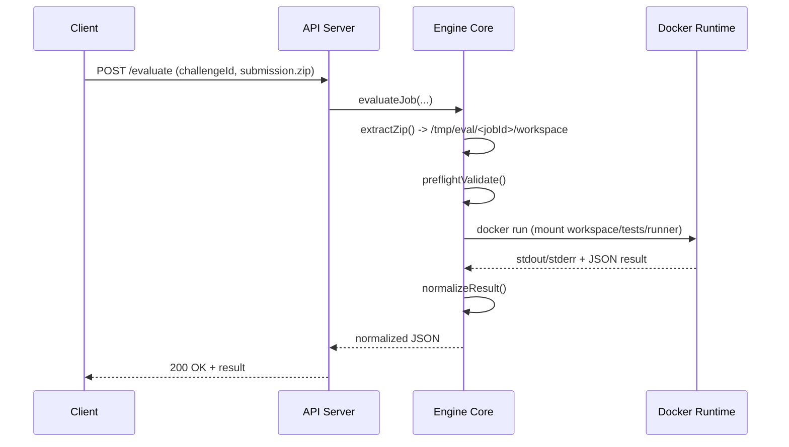
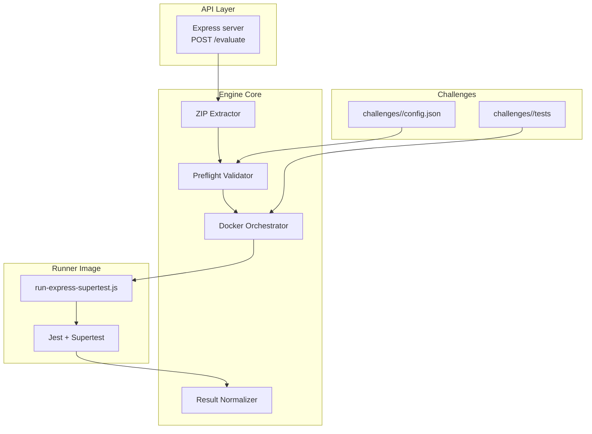

# Architecture

Eval Engine is built as a thin API layer backed by a core evaluator that orchestrates extraction, validation, sandboxed execution, and result normalization. The following diagrams capture the system from different angles.

## High-level flow

This diagram shows the end-to-end evaluation path from HTTP request to normalized result.



## Sequence diagram

This sequence shows how the API, core, and Docker runtime interact during a single evaluation.



## Component diagram

Components are separated by responsibility: the API is thin, the core owns validation and orchestration, Docker isolates execution, and challenges provide config + tests.



## Security boundaries

This diagram highlights trust boundaries between the host and the sandboxed container.

```mermaid
flowchart LR
  subgraph Host[Host]
    H1[Engine Core]
    H2[Workspace\n/tmp/eval/<jobId>/workspace]
    H3[Hidden Tests\nchallenges/<id>/tests]
    H4[Runner Scripts\nrunner/*.js]
  end

  subgraph Container[Docker Container]
    C1[/workspace (rw)]
    C2[/challenge/tests (ro)]
    C3[/runner (ro)]
    C4[Runner + Jest]
  end

  H1 -->|docker run\n--network none\n--user 1000:1000| Container
  H2 -->|mount rw| C1
  H3 -->|mount ro| C2
  H4 -->|mount ro| C3
  C4 --> C1
```

## Notes

- The runner copies hidden tests from `/challenge/tests` into `/workspace/challenge/tests` so relative imports like `../../src/app` resolve against the workspace.
- Dependencies are resolved via `NODE_PATH=/app/node_modules:/deps/<challengeId>/node_modules` so the runner and challenge runtime deps are both available.
